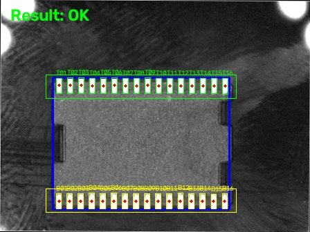
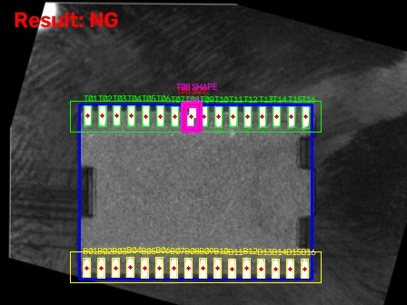
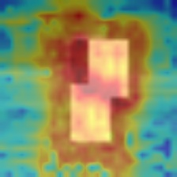

# IC Pin Hybrid Inspection

基于 **OpenCV + ResNet18 + ONNX Runtime** 的 IC 引脚离线视觉质检原型，并包含 PatchCore-style 真实工业异常检测、YOLO 与 Open3D 补充实践。

> 项目定位：机器视觉算法工程原型与技术展示。它不是可直接上线的量产 AOI 系统，也不声称具备真实产线误报率、漏检率或毫米级测量精度。

## 1. 项目概览

主系统将传统几何检测与单 Pin CNN 外观分类组合：

```text
Input IC Image
      ↓
IC Body Detection
      ↓
Deskew
      ↓
Dynamic Top / Bottom ROI
      ↓
Pin Candidate Detection
      ↓
Reference Matching
      ↓
Geometry Rule Inspection
      ↓
Reference-slot Pin Crop
      ↓
ONNX Runtime / ResNet18
      ↓
Rule NG OR CNN NG
      ↓
Final OK / NG
```

几何分支负责可解释的已知缺陷诊断，包括：

- Missing Pin
- Pitch Abnormal
- Position Shift
- Width / Height / Area Abnormal
- Shape Candidate

CNN 分支使用 Reference-slot aligned crop，对单 Pin 局部外观进行 `normal / defect` 二分类。

最终融合规则：

```text
Final NG = Rule NG OR CNN NG
```

## 2. 已验证结果

### 2.1 IC 主系统固定回归

8 个固定受控样例在目标 Windows 环境中使用 ONNX Runtime 实测：

```text
Regression = 8/8 PASS
Overall = PASS
```

| Case | Expected |
|---|---:|
| Normal | OK |
| Missing Top | NG |
| Missing Bottom | NG |
| Position Shift | NG |
| Width Abnormal | NG |
| Height Abnormal | NG |
| Area Abnormal | NG |
| Shape Abnormal | NG |

### 2.2 MVTec AD `transistor` 真实数据扩展

PatchCore-style 模块进一步使用 MVTec AD `transistor` 的真实工业图像进行完整测试：

- `train/good`: **213** 张正常图建立正常特征库
- `test`: **100** 张完整测试图
  - good: 60
  - bent_lead: 10
  - cut_lead: 10
  - damaged_case: 10
  - misplaced: 10

总体结果：

| Metric | Result |
|---|---:|
| Image-level AUROC | **0.9371** |
| Image-level AP | **0.9546** |
| Pixel-level AUROC | 0.8417 |
| Pixel-level AP | 0.4784 |

分类别图像级结果：

| Defect | AUROC | AP |
|---|---:|---:|
| bent_lead | **0.9967** | **0.9833** |
| cut_lead | 0.9533 | 0.8845 |
| damaged_case | **0.9983** | **0.9909** |
| misplaced | 0.8000 | 0.8273 |

该模块负责 **异常发现与热力图定位**，不负责输出缺陷语义类别。类别标签仅用于测试后的分组评估。

完整结果与局限见 [`docs/MVTEC_TRANSISTOR_RESULTS.md`](docs/MVTEC_TRANSISTOR_RESULTS.md)。

### 2.3 可视化示例

| Normal IC | Controlled shape abnormality |
|---|---|
|  |  |

补充 PatchCore-style synthetic heatmap 示例：



> 上述 PatchCore 图来自项目自建 synthetic Pin patch；MVTec 原始/衍生图片不随仓库分发。

## 3. 项目结构

```text
.
├─ src/
│  ├─ main.py                         # 单图完整检测入口
│  ├─ batch_test.py                   # 8-case 回归 / 批量检测
│  ├─ config.py
│  ├─ recipe.py
│  ├─ recipe_ic_a.json
│  └─ utils.py
├─ training/
│  ├─ dataset.py
│  ├─ train_resnet18.py
│  └─ export_onnx.py
├─ experiments/
│  ├─ patchcore_demo.py               # IC Pin synthetic PatchCore-style demo
│  ├─ patchcore_transistor_full_eval.py # MVTec transistor full evaluation
│  ├─ yolo_demo.py
│  └─ open3d_demo.py
├─ data/
│  ├─ input/                          # 8-case controlled regression
│  ├─ reference/                      # geometric reference
│  └─ pin_cls_raw/                    # local Pin classification samples
├─ models/
│  └─ resnet18_pin_demo.onnx
├─ docs/
│  ├─ PROJECT_SCOPE.md
│  ├─ MVTEC_TRANSISTOR_RESULTS.md
│  ├─ THIRD_PARTY_DATA.md
│  └─ images/
├─ tests/
│  ├─ regression_manifest.csv
│  └─ VALIDATION.md
├─ requirements.txt
├─ requirements-training.txt
├─ requirements-experiments.txt
└─ .gitignore
```

## 4. 环境安装

核心 IC 检测：

```powershell
python -m pip install -r requirements.txt
```

重新训练 ResNet18：

```powershell
python -m pip install -r requirements-training.txt
```

运行 PatchCore / YOLO / Open3D 补充实验：

```powershell
python -m pip install -r requirements-experiments.txt
```

本项目开发与验证环境使用 Python 3.12；核心回归在 Windows 环境下使用 ONNX Runtime 1.30.0 实测通过。

## 5. 单图检测

在仓库根目录运行：

```powershell
python .\src\main.py test_chip.jpg
```

异常样例：

```powershell
python .\src\main.py defect_bent_top_T08.jpg
```

输入默认从 `data/input/` 读取。结果写入：

```text
output/deskewed/
output/cnn_diagnostic/
output/results/
```

终端输出包括：

```text
Rule Result = OK / NG
CNN Result  = OK / NG
CNN NG Pins = ...
Final Result = OK / NG
```

## 6. 8-case 回归

```powershell
python .\src\batch_test.py
```

期望：

```text
Regression = 8/8 PASS
Overall = PASS
```

检测 `data/input` 下全部 JPG：

```powershell
python .\src\batch_test.py --all
```

## 7. Recipe 与关键参数

`src/recipe_ic_a.json` 保存当前产品相关参数，例如：

- Body threshold
- Body area / center / rectangularity limits
- Pin ROI ratios
- Pin candidate area / aspect limits
- Reference matching tolerance
- Missing / Pitch / Position / Size / Shape thresholds
- Reference image path
- CNN patch size / threshold / provider

当前关键值：

```text
Body threshold = 95
Pin threshold = 150
Expected pins per row = 16
Matching tolerance = ±0.45 pitch
CNN threshold = 0.50
CNN crop = Reference-slot aligned
```

## 8. ResNet18 与 ONNX

当前 CNN 是局部 Pin 外观二分类器：

```text
normal / defect
```

训练样本为同一受控场景下的 32 个 normal Pin patch 与 4 个 synthetic defect patch，因此训练结果只用于链路验证，不作为真实泛化精度。

训练：

```powershell
python .\training\train_resnet18.py
```

导出 ONNX：

```powershell
python .\training\export_onnx.py
```

主系统最终通过 ONNX Runtime 执行推理。

## 9. PatchCore-style 异常检测

### 9.1 本项目 Pin synthetic demo

```powershell
python .\experiments\patchcore_demo.py
```

用于理解：

```text
normal feature memory bank
→ nearest-neighbor patch distance
→ anomaly score
→ anomaly heatmap
```

### 9.2 MVTec AD `transistor` 全测试集

MVTec 原始图片不包含在仓库中。下载官方 `transistor` 数据并保持：

```text
D:\datasets\transistor\
├─ train\good\
├─ test\...
└─ ground_truth\...
```

运行：

```powershell
python .\experiments\patchcore_transistor_full_eval.py --mvtec-root D:\datasets
```

默认输出：

```text
experiments/outputs_full_transistor/
├─ image_scores.csv
├─ per_category_metrics.csv
├─ score_statistics.csv
├─ metrics_summary.json
├─ evaluation_report.txt
├─ heatmaps/
└─ overlays/
```

> 这是 PatchCore-style 简化实现，不是官方 PatchCore 完整复现。当前实现使用冻结 ResNet18 的 `layer2 + layer3` 特征，并对 Memory Bank 做随机子采样。

## 10. YOLO 与 Open3D 补充实践

YOLO11n 推理：

```powershell
python .\experiments\yolo_demo.py --image D:\path\to\your_image.jpg
```

脚本同时包含一个显式的 IoU/NMS 小例子。首次运行时，Ultralytics 可能需要联网获取 `yolo11n.pt`。

Open3D 点云处理：

```powershell
python .\experiments\open3d_demo.py
```

流程包括：

```text
voxel downsampling
→ statistical outlier removal
→ RANSAC plane segmentation
→ DBSCAN clustering
```

## 11. 已知边界

- 当前是离线受控视觉原型，不是量产 AOI。
- 没有真实相机标定，因此几何量只使用像素，不声称毫米精度。
- 主系统 CNN 数据量很小，不能据此声明工业泛化能力。
- 亮度变化的独立实验曾使用额外参考亮度归一化，但该步骤未集成进当前 `main.py`。
- PatchCore-style 模块能够进行异常分数计算和热力图定位，但不会自动给出异常语义类别。
- MVTec AD 数据不随仓库分发；请遵守其官方许可条款。
- 未实现 PLC / 相机 SDK / 实时产线节拍 / TensorRT / OpenVINO 等量产接口。

## 12. 文档

- [`docs/PROJECT_SCOPE.md`](docs/PROJECT_SCOPE.md)：项目范围与能力边界
- [`docs/MVTEC_TRANSISTOR_RESULTS.md`](docs/MVTEC_TRANSISTOR_RESULTS.md)：真实 MVTec 完整评测
- [`tests/VALIDATION.md`](tests/VALIDATION.md)：固定回归与评测状态
- [`docs/THIRD_PARTY_DATA.md`](docs/THIRD_PARTY_DATA.md)：第三方数据与模型说明
